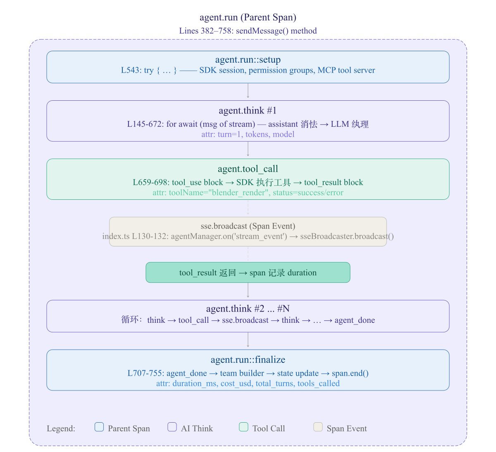

# OpenTelemetry 分布式链路追踪

> **SPEC-020** | 状态：设计中

## 目标

为 game-dev-studio 全栈系统（Node.js Express 后端 + 5 个 Python FastAPI 微服务）集成 OpenTelemetry 分布式链路追踪，使用 Jaeger 作为追踪后端，实现服务内函数调用链和跨服务 HTTP 调用的全链路可视化。

## 背景

### 现状

当前系统有 10+ 个 Docker 容器，涉及 Express 后端和多个 FastAPI 微服务，但完全没有可观测性基础设施：

**问题**：
1. **无分布式追踪**：跨服务调用链路完全不可见（如 `studio-backend → creator/image-service/drawio-service/scanner`）
2. **无结构化日志**：全项目使用原始 `console.log` / `console.error` 输出，无法按 trace_id 关联日志
3. **无性能指标**：无法量化分析各服务的请求延迟、DB 查询耗时、Agent 生命周期各阶段耗时
4. **排查困难**：当 E2E 测试失败或生产环境出现问题时，只能靠 `[DEBUG:...]` 日志前缀猜上下文，无法快速定位瓶颈
5. **无可视化工具**：全链路调用关系和耗时分布没有可视化面板

### 设计动机

OpenTelemetry 是 CNCF 孵化项目，已成为分布式追踪的事实标准。通过在项目中引入 OTel + Jaeger，可以：
- 可视化微服务调用拓扑（服务依赖图）
- 追踪单个请求在多个服务间的完整路径
- 量化分析各服务内部函数调用的耗时分布
- 为后续引入 Metrics/Prometheus 打下基础

## 架构概述

```
┌─────────────────────────────────────────────────────────────────────┐
│                        Jaeger UI (port 16686)                       │
│                     http://localhost:16686                          │
└──────────────────────────────┬──────────────────────────────────────┘
                               │ OTLP gRPC (port 4317)
                               │ OTLP HTTP (port 4318)
                               │
┌──────────────────────────────▼──────────────────────────────────────┐
│                     Jaeger All-in-One (port 16686)                  │
│  ┌──────────┐  ┌──────────────┐  ┌──────────────┐                  │
│  │ Collector│──│   In-Memory  │──│   Query + UI │                  │
│  │ (OTLP)   │  │   Storage    │  │   (port 16686)│                 │
│  └──────────┘  └──────────────┘  └──────────────┘                  │
└──────────────────────────────┬──────────────────────────────────────┘
                               │ OTLP (gRPC/HTTP)
                               │
     ┌─────────────────────────┼──────────────────────────┐
     │                         │                          │
     ▼                         ▼                          ▼
┌─────────────┐    ┌───────────────────┐    ┌──────────────────┐
│ Node.js     │    │ Python FastAPI    │    │ Python FastAPI   │
│ Express     │    │ creator           │    │ image/drawio/    │
│ Backend  　 │    │ (port 8080)       │    │ scanner          │
│ (port 3000) │    │                   │    │ (ports 8081-8089)│
│             │    │ OTel Python SDK   │    │                  │
│ OTel JS SDK │    │ + auto-instrument │    │ OTel Python SDK  │
│ + auto-     │    │                   │    │ + auto-instrument│
│ instrument  │    └───────────────────┘    └──────────────────┘
│ + manual    │            ▲                        ▲
│ spans       │            │ HTTP + traceparent     │
│             │            │ header                 │
│             ├────────────┼────────────────────────┤
│             │   outbound HTTP calls (fetch/axios) │
│             │   → creator, image, drawio, scanner │
└─────────────┘                                     │
                                                    │
           ┌────────────────────────────────────────┘
           │  Service-to-Service Trace Context Propagation
           │  (W3C TraceContext: traceparent header)
           │
           ▼
   ┌──────────────────────┐
   │ MinIO / SonarQube /  │  ← No SDK (external services)
   │ drawio-export        │    OTel span wraps the
   │ (external services)  │    HTTP call without server-side tracing
   └──────────────────────┘
```

### 与现有服务的对照

| 维度 | Jaeger (新增) | SonarQube (已有) |
|------|--------------|------------------|
| 镜像 | `jaegertracing/all-in-one:latest` | `sonarqube:community` |
| 镜像大小 | ~70MB | ~500MB+ |
| 端口 | 16686 (UI), 4317 (OTLP gRPC), 4318 (OTLP HTTP) | 9000 |
| 存储 | 内存（开发/测试），可切换 Elasticsearch/Cassandra | H2（默认），可切换 PostgreSQL |
| 用途 | 分布式追踪可视化 | 代码质量静态分析 |
| 网络 | `game-studio-network` | `game-studio-network` |

## 详细设计

### 1. Jaeger 容器

在 `docker-compose.yml` 和 `docker-compose.ui-test.yml` 中新增 `jaeger` 服务（`docker-compose-sonar-check.yml` 不需要 — SonarQube 自有扫描报告）：

```yaml
# Jaeger 分布式链路追踪
jaeger:
  image: jaegertracing/all-in-one:latest
  container_name: game-studio-jaeger
  ports:
    - "${JAEGER_UI_PORT:-16686}:16686"     # Query UI
    - "${JAEGER_OTLP_GRPC_PORT:-4317}:4317"  # OTLP gRPC
    - "${JAEGER_OTLP_HTTP_PORT:-4318}:4318"  # OTLP HTTP
  environment:
    - COLLECTOR_OTLP_ENABLED=true
    - COLLECTOR_ZIPKIN_HOST_PORT=:9411
    - MEMORY_MAX_TRACES=10000
  networks:
    - game-studio-network
  healthcheck:
    test: ["CMD", "curl", "-f", "http://localhost:16686/"]
    interval: 30s
    timeout: 10s
    retries: 3
    start_period: 10s
  restart: unless-stopped
```

**关键设计决策**：
- 使用 `jaegertracing/all-in-one:latest`（内存存储），适用于开发/测试环境
- 生产环境可后续升级为 Jaeger Collector + Elasticsearch/Cassandra 分离部署
- `MEMORY_MAX_TRACES=10000` 限制内存使用，防止 OOM
- OTLP gRPC (4317) 作为主要上报协议，OTLP HTTP (4318) 作为备选
- 兼容 Zipkin 协议 (9411)，便于迁移

### 2. 涉及 docker compose 文件变更

| 文件 | Jaeger 网络 | 说明 |
|------|------------|------|
| `docker-compose.yml` | `game-studio-network` | 主服务，所有追踪上报 |
| `docker-compose.ui-test.yml` | `game-studio-network` | E2E 测试环境，追踪测试用例中的调用链 |

`docker-compose-sonar-check.yml` 不添加 Jaeger：SonarQube 自带详细的扫描报告（issues、coverage、duplications），追踪扫描链路无增量价值。

### 3. Node.js Express Backend 集成

#### 3.1 npm 依赖

```json
{
  "@opentelemetry/api": "^1.9.0",
  "@opentelemetry/sdk-node": "^0.54.0",
  "@opentelemetry/auto-instrumentations-node": "^0.52.0",
  "@opentelemetry/exporter-trace-otlp-grpc": "^0.54.0",
  "@opentelemetry/sdk-trace-node": "^1.27.0",
  "@opentelemetry/resources": "^1.27.0",
  "@opentelemetry/semantic-conventions": "^1.27.0"
}
```

#### 3.2 初始化文件

**文件**：`server/telemetry.ts`

```typescript
import { NodeSDK } from '@opentelemetry/sdk-node';
import { OTLPTraceExporter } from '@opentelemetry/exporter-trace-otlp-grpc';
import { Resource } from '@opentelemetry/resources';
import { ATTR_SERVICE_NAME, ATTR_SERVICE_VERSION } from '@opentelemetry/semantic-conventions';
import { getNodeAutoInstrumentations } from '@opentelemetry/auto-instrumentations-node';

const OTEL_EXPORTER_OTLP_ENDPOINT =
  process.env.OTEL_EXPORTER_OTLP_ENDPOINT || 'http://jaeger:4317';

const sdk = new NodeSDK({
  resource: new Resource({
    [ATTR_SERVICE_NAME]: 'studio-backend',
    [ATTR_SERVICE_VERSION]: process.env.npm_package_version || '0.1.0',
  }),
  traceExporter: new OTLPTraceExporter({
    url: OTEL_EXPORTER_OTLP_ENDPOINT,
  }),
  instrumentations: [getNodeAutoInstrumentations()],
});

// 优雅关闭：SIGTERM 时 flush 未上报的 span
process.on('SIGTERM', () => {
  sdk.shutdown().catch(() => {});
});

sdk.start();
console.log('[Telemetry] OpenTelemetry SDK started, exporting to', OTEL_EXPORTER_OTLP_ENDPOINT);
```

**文件**：`server/index.ts` （在文件最顶部引入）

```typescript
// OpenTelemetry 必须在所有其他模块之前初始化
import './telemetry.js';
```

#### 3.3 自动插桩覆盖

`getNodeAutoInstrumentations()` 自动覆盖：

| 插桩库 | 覆盖范围 |
|--------|---------|
| `@opentelemetry/instrumentation-http` | Express 入站 HTTP 请求、`fetch` / `http` 出站请求 |
| `@opentelemetry/instrumentation-express` | Express 路由层（路径、方法、状态码） |
| `@opentelemetry/instrumentation-fs` | 文件系统操作（可选，默认关闭以减少噪音） |

#### 3.4 手动 Span — 关键业务路径

以下为需要手动创建 span 的核心函数调用链（使用 `@opentelemetry/api` 的 `trace` API）：

**文件**：`server/agent-manager.ts`

```typescript
import { trace } from '@opentelemetry/api';

const tracer = trace.getTracer('studio-backend');

// agent 生命周期
async runAgent(agentId: string, userMessage: string) {
  return tracer.startActiveSpan('agent.run', async (span) => {
    span.setAttribute('agent.id', agentId);
    span.setAttribute('agent.message_length', userMessage.length);
    try {
      // ... 原有逻辑
      // 各阶段创建子 span:
      //   - span 'agent.think' → LLM 推理阶段
      //   - span 'agent.tool_call' → 工具调用阶段（带 toolName 属性）
      //   - span 'agent.sse_broadcast' → SSE 广播阶段
    } catch (err) {
      span.recordException(err as Error);
      span.setStatus({ code: SpanStatusCode.ERROR });
      throw err;
    } finally {
      span.end();
    }
  });
}
```

**Span 嵌套结构图**（在 Jaeger UI 中看到的瀑布图效果）：



**文件**：`server/sse-broadcaster.ts`

```typescript
// SSE 广播阶段
broadcast(channel: string, event: string, data: unknown) {
  const span = trace.getActiveSpan();
  if (span) {
    span.addEvent('sse.broadcast', { channel, event });
  }
  // ... 原有逻辑
}
```

**文件**：`server/db.ts`

```typescript
// DB 操作（可选，低频关键操作才加 span，避免噪音）
async addLog(entry: LogEntry) {
  return tracer.startActiveSpan('db.addLog', (span) => {
    span.setAttribute('db.operation', 'insert');
    span.setAttribute('db.table', 'logs');
    // ... 原有逻辑
  });
}
```

#### 3.5 出站 HTTP 调用的 Trace 传播

所有向微服务的 HTTP 调用（`creator-service.ts`、`image-service.ts`、`drawio-service.ts`、`video-service.ts`、`sonar-scanner-service.ts`）通过 `fetch` 或 `axios` 默认携带 W3C TraceContext header（`traceparent`），无需手动处理。

如需在 `axios` 客户端中手动启用，可在 `axios.create()` 时添加：

```typescript
import { propagation, context } from '@opentelemetry/api';

// 对所有出站请求注入 trace context
client.interceptors.request.use((config) => {
  propagation.inject(context.active(), config.headers || {});
  return config;
});
```

### 4. Python FastAPI 微服务集成

#### 4.1 Python 依赖

各微服务的 `requirements.txt` 添加：

```
opentelemetry-api>=1.27.0
opentelemetry-sdk>=1.27.0
opentelemetry-exporter-otlp-proto-grpc>=1.27.0
opentelemetry-instrumentation-fastapi>=0.48b0
opentelemetry-instrumentation-httpx>=0.48b0
opentelemetry-instrumentation-requests>=0.48b0
```

#### 4.2 初始化代码

各微服务的 `app/main.py` 在 `app = FastAPI()` 之前添加：

```python
import os
from opentelemetry import trace
from opentelemetry.sdk.trace import TracerProvider
from opentelemetry.sdk.resources import Resource, SERVICE_NAME, SERVICE_VERSION
from opentelemetry.exporter.otlp.proto.grpc.trace_exporter import OTLPSpanExporter
from opentelemetry.sdk.trace.export import BatchSpanProcessor
from opentelemetry.instrumentation.fastapi import FastAPIInstrumentor
from opentelemetry.instrumentation.httpx import HTTPXClientInstrumentor

SERVICE = os.getenv("OTEL_SERVICE_NAME", "creator")  # 按微服务调整
OTEL_ENDPOINT = os.getenv("OTEL_EXPORTER_OTLP_ENDPOINT", "http://jaeger:4317")

resource = Resource(attributes={
    SERVICE_NAME: SERVICE,
    SERVICE_VERSION: "0.1.0",
})

provider = TracerProvider(resource=resource)
processor = BatchSpanProcessor(
    OTLPSpanExporter(endpoint=OTEL_ENDPOINT, insecure=True)
)
provider.add_span_processor(processor)
trace.set_tracer_provider(provider)

# FastAPI 自动插桩
FastAPIInstrumentor.instrument_app(app)

# HTTPX 客户端自动插桩（出站请求 trace context 传播）
HTTPXClientInstrumentor().instrument()
```

**各微服务 OTEL_SERVICE_NAME**：

| 微服务 | `OTEL_SERVICE_NAME` |
|--------|---------------------|
| creator | `creator` |
| image-service | `image-service` |
| drawio-service | `drawio-service` |
| scanner | `scanner` |
| video-service (后续) | `video-service` |

#### 4.3 手动 Span

各微服务的核心路由中，对关键操作添加手动 span：

```python
from opentelemetry import trace

tracer = trace.get_tracer(__name__)

@router.post("/api/blender/render")
async def render(request: RenderRequest):
    with tracer.start_as_current_span("blender.render") as span:
        span.set_attribute("blender.output_format", request.output_format)
        span.set_attribute("blender.project_id", request.project_id)
        # ... 原有逻辑
```

### 5. Docker Compose Backend 环境变量

`docker-compose.yml` 和 `docker-compose.ui-test.yml` 中 `studio-backend` 添加：

```yaml
studio-backend:
  environment:
    # ... 已有变量
    - OTEL_EXPORTER_OTLP_ENDPOINT=http://jaeger:4317
    - OTEL_SERVICE_NAME=studio-backend
```

各微服务添加：

```yaml
# 以 creator 为例
creator:
  environment:
    - OTEL_EXPORTER_OTLP_ENDPOINT=http://jaeger:4317
    - OTEL_SERVICE_NAME=creator
    # ... 已有变量
```

### 6. 服务启动依赖

所有集成 OTel 的服务需添加 `depends_on jaeger`，确保 trace 采集不丢初始 span。OTel SDK 虽 fail-open（Jaeger 不可达不影响业务），但启动时 Jaeger 就绪可保证完整 trace：

| 服务 | 新增 depends_on |
|------|----------------|
| `studio-backend` | `jaeger` (condition: service_healthy) |
| `creator` | `jaeger` (condition: service_healthy) |
| `image-service` | `jaeger` (condition: service_healthy) |
| `drawio-service` | `jaeger` (condition: service_healthy) |
| `scanner` | `jaeger` (condition: service_healthy) |

```yaml
# 示例：studio-backend depends_on 新增一行
studio-backend:
  depends_on:
    # ... 已有依赖
    jaeger:
      condition: service_healthy
```

### 7. 数据流

```
1. Client Request
   │  GET /api/agents/agent-1/message
   ▼
2. studio-backend Express route
   │  Span: "HTTP GET /api/agents/:id/message"  (auto-instrumented)
   │  traceparent: 00-<trace_id>-<span_id>-01
   ▼
3. agent-manager.runAgent()
   │  Span: "agent.run"  (manual)
   │  ├── Span: "agent.think"  (LLM call, auto-instrumented HTTP)
   │  ├── Span: "agent.tool_call"  (manual, attr: toolName="creator_render")
   │  │   │  outbound HTTP to creator (trace context auto-propagated)
   │  │   ▼
   │  │   creator FastAPI /api/blender/render
   │  │   Span: "POST /api/blender/render"  (auto-instrumented)
   │  │   ├── Span: "blender.render"  (manual)
   │  │   └── Span: "subprocess.run blender"  (manual)
   │  │
   │  └── Span: "sse.broadcast"  (manual event)
   ▼
4. Jaeger Collector (OTLP gRPC)
   │  Batch span processing
   ▼
5. Jaeger In-Memory Storage → Jaeger UI
```

### 7. Jaeger UI 使用指南

访问 `http://localhost:16686`：

| Tab | 功能 |
|-----|------|
| **Search** | 按 Service、Operation、Tags、Duration 搜索 trace |
| **Trace View** | 瀑布图展示单次请求的完整调用链（span 嵌套 + 耗时分布） |
| **Dependencies** | 服务依赖拓扑图（DAG 可视化微服务间调用关系） |
| **Compare** | 对比两次 trace 的耗时差异 |

### 8. trace 采样策略

- **开发/测试环境**：始终采样（`AlwaysOnSampler`） — OTel SDK 默认行为
- **生产环境可配置**：通过环境变量 `OTEL_TRACES_SAMPLER=parentbased_always_on` 或 `traceidratio` 控制采样率，无需改代码

## 相关文件

| 文件 | 角色 | 变更幅度 |
|------|------|---------|
| `server/telemetry.ts` | Node.js OTel SDK 初始化 | 新增 |
| `server/index.ts` | 在最顶部引入 telemetry.ts | 低（~2行） |
| `server/agent-manager.ts` | 手动 span：agent.run, agent.think, agent.tool_call | 中（~30行） |
| `server/sse-broadcaster.ts` | 手动 span event：sse.broadcast | 低（~10行） |
| `server/db.ts` | 可选：关键 DB 操作添加 span | 低（~15行） |
| `server/creator-service.ts` | 出站 HTTP 调用的 trace context 传播（如需要） | 低（~5行） |
| `server/image-service.ts` | 同上 | 低（~5行） |
| `server/drawio-service.ts` | 同上 | 低（~5行） |
| `server/sonar-scanner-service.ts` | 同上 | 低（~5行） |
| `creator/app/main.py` | Python OTel SDK 初始化 + FastAPI 自动插桩 | 中（~30行） |
| `creator/requirements.txt` | 添加 OTel Python 依赖 | 低（~6行） |
| `image-service/app/main.py` | Python OTel SDK 初始化 | 中（~30行） |
| `image-service/requirements.txt` | 添加 OTel Python 依赖 | 低（~6行） |
| `drawio-service/app/main.py` | Python OTel SDK 初始化 | 中（~30行） |
| `drawio-service/requirements.txt` | 添加 OTel Python 依赖 | 低（~6行） |
| `sonar-scanner-service/app/main.py` | Python OTel SDK 初始化 | 中（~30行） |
| `sonar-scanner-service/requirements.txt` | 添加 OTel Python 依赖 | 低（~6行） |
| `docker-compose.yml` | 新增 jaeger 服务 + backend/微服务 env 变量 + depends_on | 中（~40行） |
| `docker-compose.ui-test.yml` | 同上（测试环境） | 中（~40行） |
| `package.json` | 添加 OTel Node.js 依赖 | 低（~8行） |
| `.agent/specs/INDEX.md` | 新增 SPEC-020 索引 | 低（~1行） |

## 可行性分析

| 检查项 | 结论 |
|--------|------|
| 是否需要后端改动 | 是 — Express backend + 5 个 FastAPI 微服务均需添加 OTel SDK 初始化 |
| 数据是否已存在 | N/A — 新增 Jaeger 内存存储 |
| 是否需要新 DB 表 | 否 — Jaeger 自带 in-memory storage |
| 是否影响现有功能 | 否 — OTel SDK 以 sidecar 方式运行，启动失败不影响业务逻辑（fail-open 策略） |
| 性能影响 | 极低 — OTLP 批量上报（BatchSpanProcessor），span 采样在内存中完成，网络开销 ~1ms/span |
| 是否需要新增 SSE 事件 | 否 |
| 是否需要 E2E 测试 | 否（基础设施层变更，无前端交互） |

### 结论

方案可行，无风险。OTel SDK 以非侵入方式挂载，不影响现有业务逻辑。Jaeger all-in-one 镜像仅 70MB，内存占用低，适合开发/测试环境。

## 测试策略

1. **集成测试**：
   - 启动 `docker compose up` 后验证 Jaeger UI 可访问（`curl http://localhost:16686`）
   - 向 backend 发起一次请求，在 Jaeger UI 中搜索 trace 确认上报成功
   - 验证跨服务 trace context 传播：请求触发 `studio-backend → creator` 调用链，确认 Jaeger 中显示为同一 trace

2. **单元测试**：
   - 验证 `server/telemetry.ts` 初始化不抛异常
   - 验证 Python OTel SDK 初始化不抛异常
   - 验证 OTLP exporter 在服务配置的 endpoint 上连接成功

3. **E2E 测试**：
   - 不影响现有 E2E 测试用例（OTel 作为旁路基础设施）
   - 可选：在 `ui-e2e` 中增加一个 trace 验证步骤（通过 Jaeger API 查询 trace 是否存在）

## UI Test 验收规则

提交代码前必须跑通 ui test。
如遇网络或依赖问题，可临时修改代码解决网络问题，但禁止提交为了解决网络依赖问题所做的变更。

## 主动补全 UI Test 规范

本 spec 为基础设施层变更，无前端交互功能。不涉及 UI-XXX 测试用例和 testid 添加。

如后续有基于 trace 数据的前端可视化功能（如 Trace 面板），则需：
1. `tests/ui/e2e/studio.spec.ts` — 添加 UI-XXX 测试用例
2. `.agent/memory/E2E_TESTING.md` — 更新测试矩阵、testid 对照表
3. `.agent/specs/opentelemetry-tracing.md` — 更新本文档测试策略章节

## 详细 Debug 日志规范

### 后端日志

OpenTelemetry 初始化：
```
[Telemetry] OpenTelemetry SDK started, exporting to http://jaeger:4317
[Telemetry] Failed to initialize OTel SDK: <error>  (fail-open, server continues)
```

手动 Span 创建：
```
[DEBUG:AgentManager] span:agent.run created for agentId=<id>
[DEBUG:AgentManager] span:agent.tool_call toolName=<name> duration=<ms>ms
```

### Python 微服务日志

```
[OTel] Service <service_name> initialized, exporting to <endpoint>
[OTel] FastAPIInstrumentor instrumented <N> routes
```

## 验证标准

1. `docker compose up` 后 Jaeger UI（`http://localhost:16686`）可访问
2. 向 `studio-backend` 发起任意 API 请求后，Jaeger Search 中可搜到 `studio-backend` service 的 trace
3. 同一 trace 中包含 Express 路由 span（如 `GET /api/agents`）和 HTTP 出站请求 span
4. 通过 agent 触发跨服务调用（如 creator 渲染）后，同一 trace 中包含 `studio-backend` 和 `creator` 两个 service 的 span
5. Jaeger Dependencies 页面显示 `studio-backend → creator` 等服务间调用关系
6. `docker-compose.yml` 和 `docker-compose.ui-test.yml` 中 `jaeger` 服务正常启动且 healthcheck 通过
7. OTel SDK 初始化失败时（如 Jaeger 不可达），server 仍能正常启动并处理请求（fail-open）

## 注意事项

- **fail-open 策略**：OTel SDK 初始化失败或 Jaeger 不可达时，业务逻辑不受影响。span 导出失败仅记录日志，不抛异常
- **内存存储限制**：Jaeger all-in-one 内存存储 `MEMORY_MAX_TRACES=10000`，适合开发/测试。生产环境需升级为 Elasticsearch 或 Cassandra 后端
- **性能开销**：`BatchSpanProcessor` 异步批量上报，每个 span 的内存和网络开销约为数微秒级别，对请求延迟影响可忽略
- **不插桩的服务**：MinIO、SonarQube、drawio-export 等外部镜像不做 OTel 插桩，其调用延迟通过 studio-backend 侧 HTTP outbound span 间接观测
- **视频服务**：后续 SPEC-009（video-service）实现时按相同模式添加 OTel 插桩
- **采样策略**：保持默认 AlwaysOn，后续可按环境变量 `OTEL_TRACES_SAMPLER` 调整
- **ESM 兼容**：Node.js backend 使用 ESM 模块，`@opentelemetry/sdk-node` 完全兼容，初始化文件使用 `.ts` 扩展名正常编译
- **SonarQube CI**：`docker-compose-sonar-check.yml` 不添加 Jaeger — SonarQube 自带完整扫描报告，追踪扫描链路无增量价值
