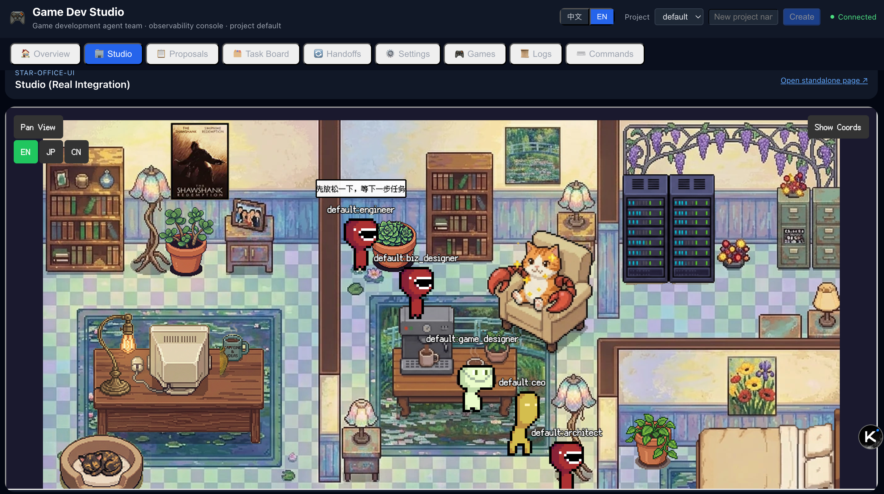
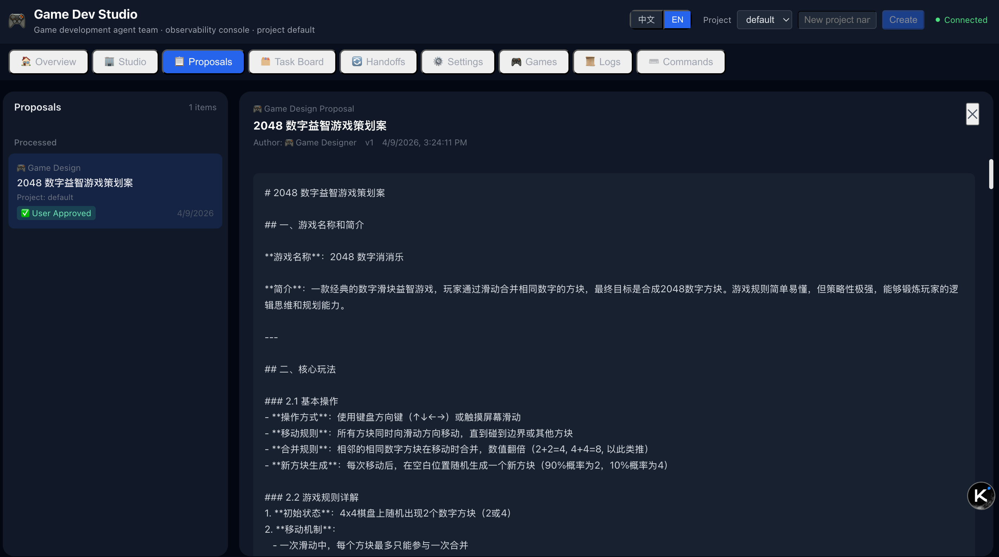
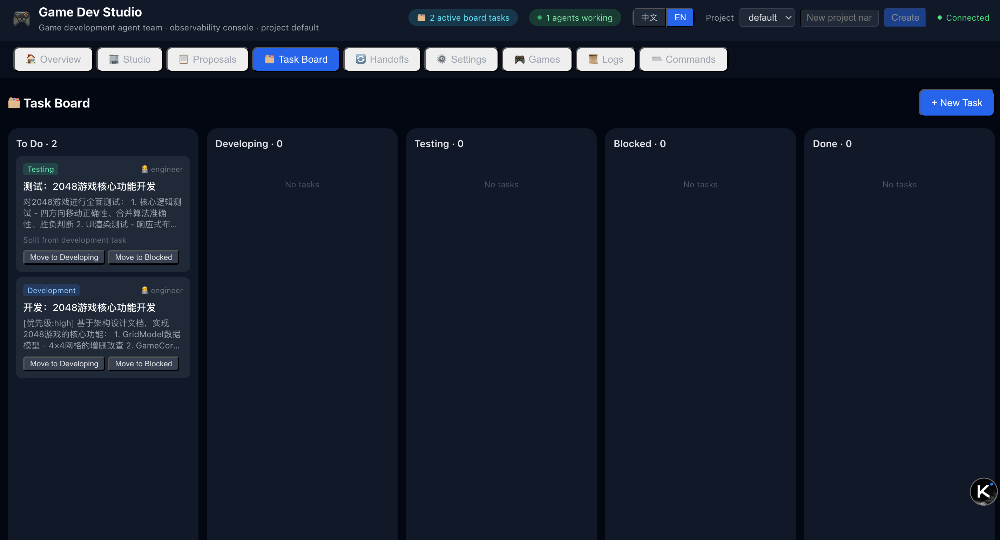
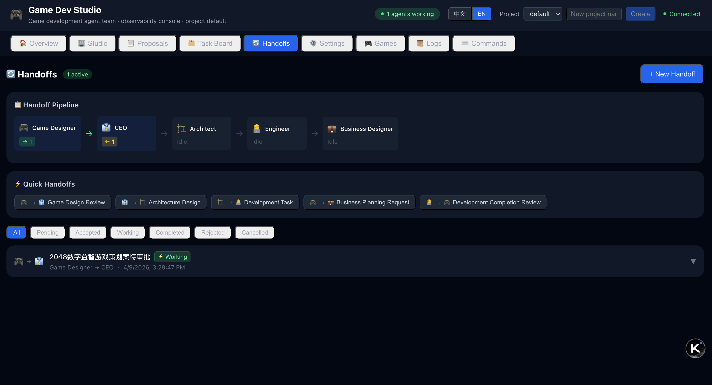
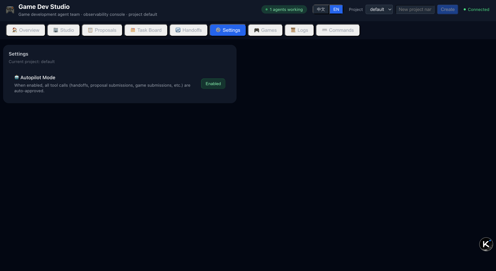
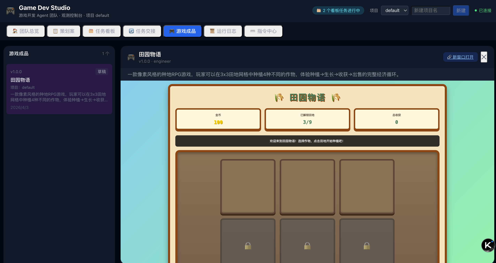
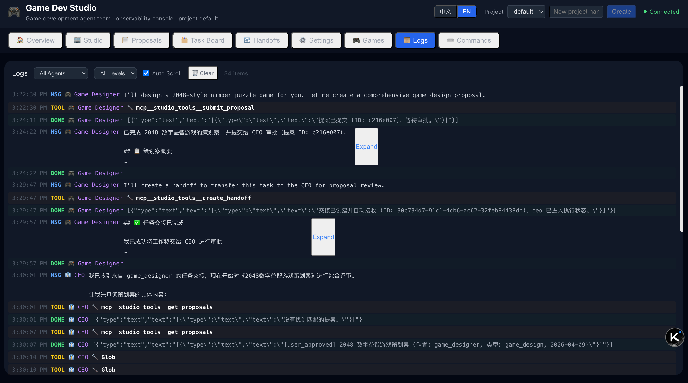
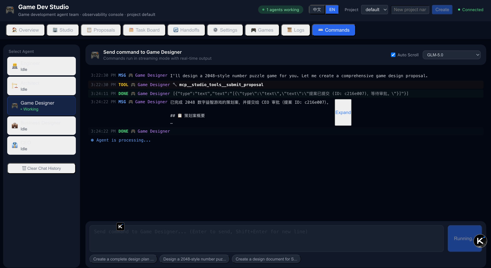

# Game Dev Studio

[中文文档 (Chinese)](./README.zh-CN.md)


A multi-agent game development workspace built on the CodeBuddy Agent SDK, providing team collaboration, proposal review, task boards, handoff workflows, game artifact management, runtime observability, and Star-Office-UI integration.

## Feature Overview

- Multi-role agent team (Engineer, Architect, Game Designer, Business Designer, CEO, Team Building)
- Command center (assign tasks to specific agents with SSE streaming responses)
- Studio integration (embedded Star-Office-UI with two-way state sync)
- Task board (development/testing task breakdown and status flow)
- Task handoff (cross-role transfer, acceptance, execution confirmation, completion callback)
- Project settings (auto-handoff toggle)
- Proposal management (create, review, and human decision)
- Game artifact management (submit HTML artifacts or packaged files, preview, download, and version status)
- Blender modeling pipeline (creator service + `blender_*` tools for project/mesh/material/export/file operations)
- Static analysis (extensible lint framework with pluggable checkers for HTML structure/HTTP method safety/JS security, supports HTML mode and ZIP package mode)
- Long-term agent memory (save/query/clear)
- Project isolation (data and observability streams isolated by `project_id`)

## UI Preview











## Tech Stack

- Backend: Node.js + Express + TypeScript
- Frontend: React 18 + TypeScript + Vite
- Database: SQLite (`better-sqlite3`)
- UI: TDesign React
- AI: `@tencent-ai/agent-sdk`

## Quick Start

### 1) Install dependencies

```bash
npm install
```

### 2) Configure environment variables (optional but recommended)

```bash
cp .env.example .env
```

- To enable model calls, set `CODEBUDDY_API_KEY` in `.env` (or inject `CODEBUDDY_AUTH_TOKEN` at runtime).
- Without credentials, the system can still start, but AI capabilities are limited.

### 3) Start development mode (frontend + backend)

```bash
npm run dev
```

- Frontend default: `http://localhost:5173`
- Backend default: `http://localhost:3000`

### 4) Build

```bash
npm run build
```

## Common Scripts

```bash
# Run frontend and backend together
npm run dev

# Backend only (direct run with tsx)
npm run dev:server

# Frontend only
npm run dev:client

# Production build
npm run build

# Preview frontend build output
npm run preview

# Start backend entry directly
npm run server
```

## Key Environment Variables (Local Development)

| Variable | Default | Description |
|---|---|---|
| `PORT` | 3000 | Backend service port |
| `CODEBUDDY_BASE_URL` | empty | Optional SDK endpoint override (e.g. for local mock server) |
| `CODEBUDDY_API_KEY` | empty | API key for model calls |
| `CODEBUDDY_AUTH_TOKEN` | empty | Runtime auth token (alternative to API key) |
| `VITE_API_BASE` | `http://localhost:3000` | Frontend API base URL |
| `VITE_STAR_OFFICE_UI_URL` | `http://127.0.0.1:19000` | Embedded Studio URL in frontend tab |
| `STAR_OFFICE_UI_URL` | `http://127.0.0.1:19000` | Backend sync service base URL |
| `CREATOR_SERVICE_URL` | `http://localhost:8080` | Blender creator service base URL used by backend modeling tools |
| `STAR_OFFICE_JOIN_KEY` | `ocj_example_team_01` | Agent registration key |
| `STAR_OFFICE_SYNC_DEBOUNCE_MS` | 300 | State sync debounce interval (ms) |
| `STAR_OFFICE_HEALTH_CHECK_INTERVAL_MS` | 10000 | Star Office health check interval (ms) |

## Docker Deployment

For containerized deployment, see [README-Docker.md](./docs/README-Docker.md).

## Project Structure

```text
game-studio/
├── server/                 # Backend services and agent orchestration
│   ├── index.ts            # API and SSE entry
│   ├── agent-manager.ts    # Agent lifecycle and message dispatch
│   ├── tools.ts            # MCP custom tools
│   ├── lint/               # Extensible lint framework (LintRunner + checkers)
│   ├── agents.ts           # Team role definitions and system prompts
│   ├── star-office-sync.ts # Star-Office-UI sync service
│   └── db.ts               # SQLite schema and data access
├── src/                    # Frontend app
│   ├── pages/StudioPage.tsx
│   ├── components/         # Business panels
│   ├── config.ts           # API wrappers
│   └── types.ts            # Shared business types
├── star-office-ui/         # Star-Office-UI Docker build resources
├── creator/                # Blender creator service (FastAPI + Blender runtime)
├── docs/images/            # README preview images
├── data/                   # SQLite database files (runtime-generated)
├── output/                 # Proposal/game outputs (runtime-generated)
├── docker-compose.yml
├── docker-compose.ui-test.yml
├── Makefile
├── README.md
├── docs/
│   ├── README-Docker.md
│   ├── README-Docker.zh-CN.md
│   ├── DEVELOPMENT.md
│   ├── DEVELOPMENT.zh-CN.md
│   ├── ARCHITECTURE.md
│   ├── ARCHITECTURE.zh-CN.md
│   └── images/
└── README.zh-CN.md
```

## API Overview

Main endpoints (prefix `/api`):

- Basic: `/health` `/models` `/check-login` `/observe`
- Agents: `/agents` `/agents/:agentId/messages` `/agents/:agentId/command` `/agents/:agentId/pause` `/agents/:agentId/resume`
- Proposals: `/proposals` `/proposals/:id` `/proposals`(POST) `/proposals/:id/review` `/proposals/:id/decide`
- Games: `/games` `/games/:id` `/games`(POST) `/games/:id/preview` `/games/:id`(PATCH)
- File storage: `/file-storage` `/file-storage/:id` `/file-storage/:id/download`
- Projects: `/projects`(GET/POST) `/projects/switch`(POST) `/projects/:id/settings`(GET/PATCH)
- Handoffs: `/handoffs` `/handoffs/pending` `/handoffs/:id/(accept|confirm|complete|reject|cancel)`
- Tasks: `/tasks` `/tasks/:id/status`
- Memory: `/agents/:agentId/memories`(GET/POST/DELETE) `/memories` `/memories/:id`
- Logs: `/projects/:projectId/logs`(GET/DELETE)
- Sessions and commands: `/agents/:agentId/messages`(DELETE) `/commands`
- Permission: `/permission-response`

`/api/projects/switch` is now a lightweight project-context switch endpoint and no longer triggers Star-Office agent offline/online transitions.

## Project Data and Artifacts

- Supports multi-project isolation via `project_id`.
- MCP custom tool schemas no longer require `project_id`; backend injects scoped project context at tool-server initialization and enforces isolation internally.
- Database tables are initialized by the `CREATE TABLE` DDL in `server/db.ts`; when changing schema, update DDL first and use migrations only for legacy data backfill.
- `games` no longer stores `author_agent_id`; `/api/games` and `submit_game` no longer require this field.
- `agent_messages`, `logs`, `commands`, and `permission_requests` all include `updated_at` for lifecycle/audit tracking.
- Proposal/game submissions are also written to `output/{project_id}/...`.
- `submit_game` supports two modes: HTML content mode (`html_content`) and packaged file mode (`file_path` -> ZIP -> `file_storage_id`).
- `get_games` lists submitted games in the current project (newest first, with basic metadata and mode flags).
- `get_game_info` returns full HTML content for HTML-mode games, or a MinIO presigned download URL for file-mode games.
- Blender modeling projects are tracked in `blender_projects`, bound to `project_id` and `blender_project_id`.
- `blender_download_model_file` / `blender_delete_model_file` use safe path validation to prevent path traversal.
- Packaged mode stores ZIP assets in MinIO and keeps metadata in `file_storages`.
- `/output` is served as static content (HTML returned with `text/html; charset=utf-8`).

## Extension Development

See [DEVELOPMENT.md](./docs/DEVELOPMENT.md).

## Architecture Documentation

See [ARCHITECTURE.md](./docs/ARCHITECTURE.md).


## UI Testing

```bash
# Recommended: use Makefile to run UI tests (build + start)
mkdir -p tests/ui/artifacts
make compose-ui-test-build

# Start already-built UI test services (cluster auto-down when ui-e2e exits)
make compose-ui-test-up

# Stop UI test services
make compose-ui-test-down
```

- Playwright videos/traces and reports are written to `tests/ui/artifacts/`.
- UI test coverage summary is generated at `tests/ui/artifacts/ui-coverage-summary.json` with a required threshold of 90%.
- Manual local run (requires separate terminals):

```bash
# Install dependencies once before starting services/tests
npm ci

# Terminal 1: start CodeBuddy SDK mock server
npm run mock:server

# Terminal 2: start Studio backend (real /api/*), but route CodeBuddy SDK traffic to the mock server
CODEBUDDY_BASE_URL=http://localhost:3001 CODEBUDDY_API_KEY=mock-codebuddy-key STAR_OFFICE_UI_URL=http://127.0.0.1:19000 npm run server

# Terminal 3: start UI app and point it to the real Studio backend
VITE_API_BASE=http://localhost:3000 VITE_STAR_OFFICE_UI_URL=http://127.0.0.1:19000 npm run dev:client -- --host 0.0.0.0 --port 4173

# Terminal 4: run UI tests + coverage + allure generation
STUDIO_API_BASE=http://localhost:3000 STAR_OFFICE_API_BASE=http://localhost:19000 CODEBUDDY_MOCK_ADMIN_URL=http://localhost:3001 npm run test:ui:ci
```
