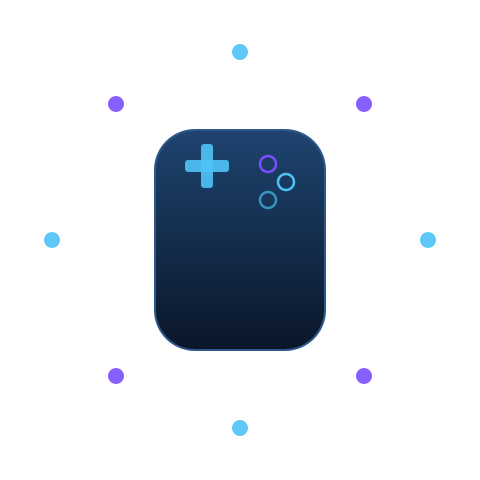
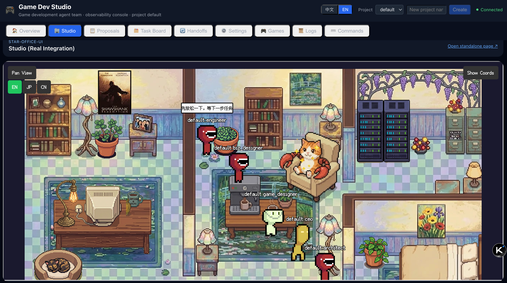
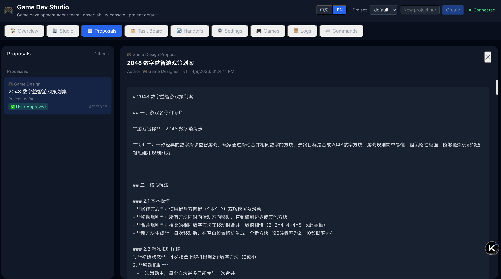
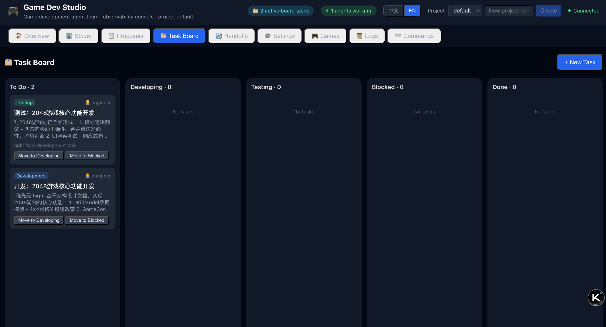
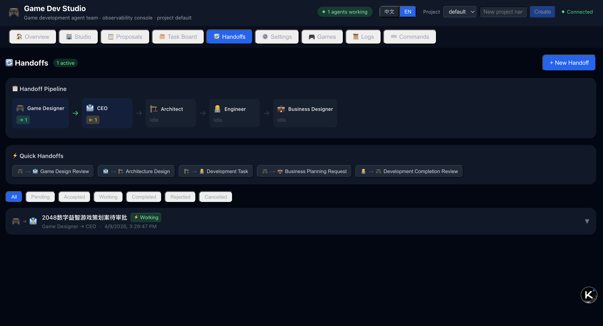
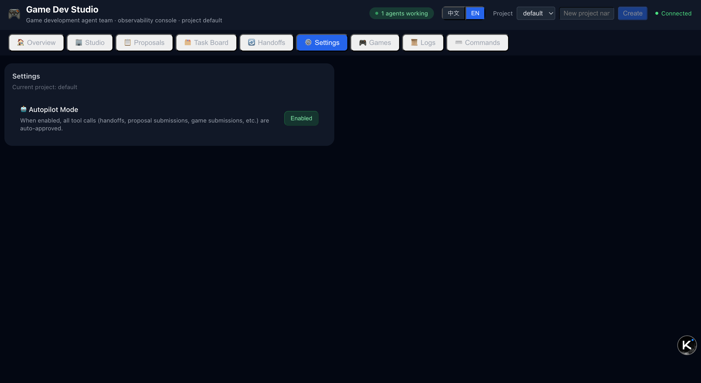
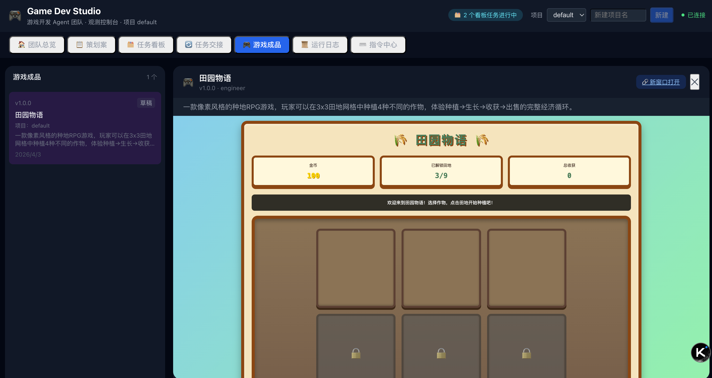
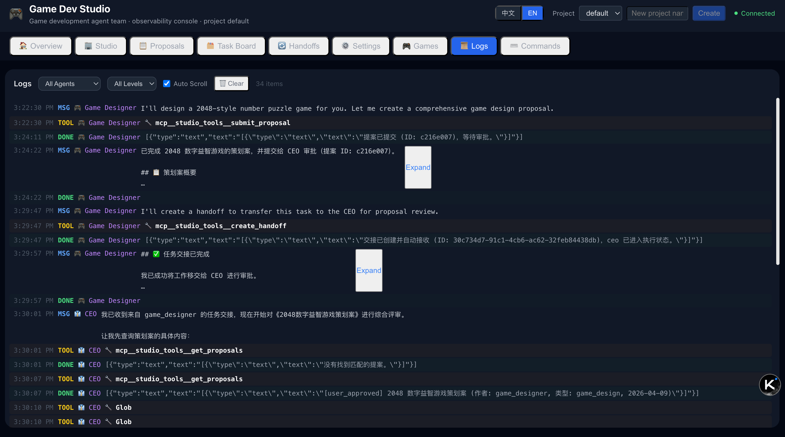
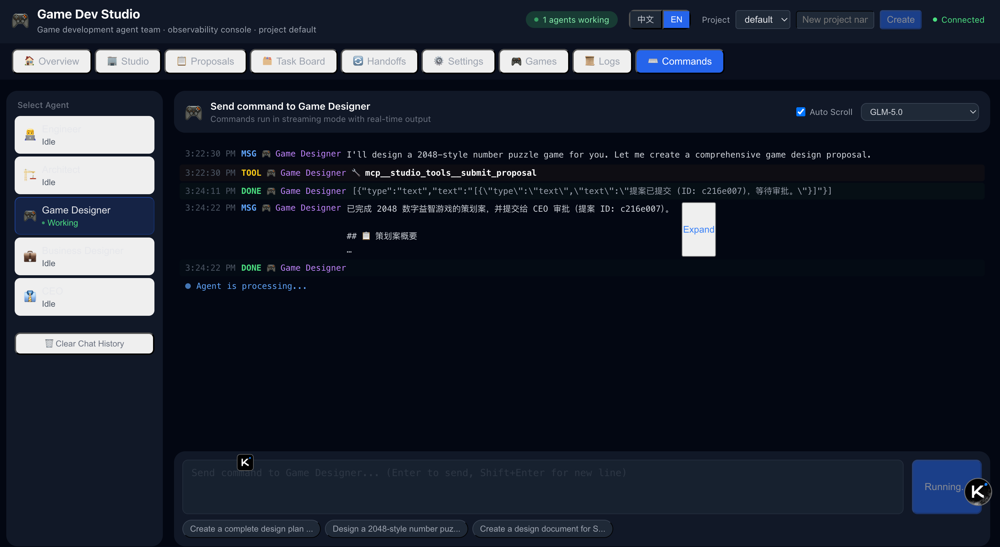

<p align="center">
  
</p>

# Game Dev Studio

[中文文档 (Chinese)](./README.zh-CN.md)


A multi-agent game development workspace built on the CodeBuddy Agent SDK, providing team collaboration, proposal review, task boards, handoff workflows, game artifact management, runtime observability, and Star-Office-UI integration.

## Feature Overview

- Multi-role agent team (Engineer, Architect, Game Designer, Business Designer, CEO, Team Building)
- Command center (assign tasks to specific agents with SSE streaming responses)
- Studio integration (embedded Star-Office-UI with two-way state sync)
- Task board (development/testing task breakdown and status flow)
- Task handoff (cross-role transfer, acceptance, execution confirmation, completion callback)
- Project settings (auto-handoff toggle)
- Proposal management (create, review, and human decision)
- Questionnaire-based proposal submission (structured game design questionnaire for non-technical users, renders to Markdown with `source='questionnaire'`)
- Proposal attachments (manual uploads or draw.io diagram exports stored in MinIO)
- Game artifact management (submit HTML artifacts or packaged files, preview, download, and version status)
- Blender modeling pipeline (creator service + `blender_*` tools for project/mesh/material/export/file operations)
- Draw.io diagram workflow (drawio-service + drawio-export for diagram CRUD and export)
- Image processing pipeline (image-service + ImageMagick + `image_*` tools for 12 image operations)
- Video processing pipeline (video-service + FFmpeg + `video_*` tools for 17 video operations)
- Static analysis (extensible lint framework with pluggable checkers for HTML structure/HTTP method safety/JS security/SonarQube quality scan, supports HTML mode and ZIP package mode)
- Sonar report download in game preview when scan artifacts are available
- Long-term agent memory (save/query/clear)
- Metadata-driven tool discovery (`search_tools` MCP tool for fuzzy searching available tools)
- Project isolation (data and observability streams isolated by `project_id`)

## UI Preview











## Tech Stack

- Backend: Node.js + Express + TypeScript
- Frontend: React 18 + TypeScript + Vite
- Database: SQLite (`better-sqlite3`)
- UI: TDesign React
- AI: `@tencent-ai/agent-sdk`

## Quick Start

### 1) Install dependencies

```bash
npm install
```

### 2) Configure environment variables (optional but recommended)

```bash
cp .env.example .env
```

- To enable model calls, set `CODEBUDDY_API_KEY` in `.env` (or inject `CODEBUDDY_AUTH_TOKEN` at runtime).
- Without credentials, the system can still start, but AI capabilities are limited.

### 3) Start development mode (frontend + backend)

```bash
npm run dev
```

- Frontend default: `http://localhost:5173`
- Backend default: `http://localhost:3000`

### 4) Build

```bash
npm run build
```

## Common Scripts

```bash
# Run frontend and backend together
npm run dev

# Backend only (direct run with tsx)
npm run dev:server

# Frontend only
npm run dev:client

# Production build
npm run build

# Preview frontend build output
npm run preview

# Start backend entry directly
npm run server
```

## Key Environment Variables (Local Development)

| Variable | Default | Description |
|---|---|---|
| `PORT` | 3000 | Backend service port |
| `CODEBUDDY_BASE_URL` | empty | Optional SDK endpoint override (e.g. for local mock server) |
| `CODEBUDDY_API_KEY` | empty | API key for model calls |
| `CODEBUDDY_AUTH_TOKEN` | empty | Runtime auth token (alternative to API key) |
| `VITE_API_BASE` | `http://localhost:3000` | Frontend API base URL |
| `VITE_STAR_OFFICE_UI_URL` | `http://127.0.0.1:19000` | Embedded Studio URL in frontend tab |
| `STAR_OFFICE_UI_URL` | `http://127.0.0.1:19000` | Backend sync service base URL |
| `CREATOR_SERVICE_URL` | `http://localhost:8080` | Blender creator service base URL used by backend modeling tools |
| `STAR_OFFICE_JOIN_KEY` | `ocj_example_team_01` | Agent registration key |
| `STAR_OFFICE_SYNC_DEBOUNCE_MS` | 300 | State sync debounce interval (ms) |
| `STAR_OFFICE_HEALTH_CHECK_INTERVAL_MS` | 10000 | Star Office health check interval (ms) |
| `SONARQUBE_PORT` | 9002 | Local SonarQube service port used by lint checker |
| `SONARQUBE_TOKEN` | `sonarpass` | SonarQube token used by `sonarqube` lint checker |
| `SCANNER_SERVICE_URL` | `http://localhost:8081` | SonarQube scanner microservice URL |
| `DRAWIO_SERVICE_URL` | `http://localhost:8082` | Draw.io service base URL used by diagram tools |
| `IMAGE_SERVICE_URL` | `http://localhost:8089` | ImageMagick image processing service base URL |
| `VIDEO_SERVICE_URL` | `http://localhost:8084` | FFmpeg video processing service base URL |

## Docker Deployment

For containerized deployment, see [README-Docker.md](./docs/README-Docker.md).

## Project Structure

```text
game-studio/
├── server/                 # Backend services and agent orchestration
│   ├── index.ts            # API and SSE entry
│   ├── agent-manager.ts    # Agent lifecycle and message dispatch
│   ├── tools.ts            # MCP custom tools
│   ├── agents.ts           # Team role definitions and system prompts
│   ├── star-office-sync.ts # Star-Office-UI sync service
│   ├── sse-broadcaster.ts  # SSE broadcast utilities
│   ├── db.ts               # SQLite schema and data access
│   ├── minio-client.ts     # MinIO client wrapper
│   ├── file-storage.ts     # File storage (MinIO) operations
│   ├── image-service.ts    # ImageMagick processing service client
│   ├── video-service.ts    # FFmpeg video processing service client
│   ├── creator-service.ts  # Blender creator service client
│   ├── drawio-service.ts   # Draw.io diagram service client
│   ├── sonar-scanner-service.ts # SonarQube scanner service client
│   ├── modeling-tool.ts    # 3D modeling tools
│   ├── proposal-attachments-api.ts # Proposal attachment API routes
│   └── lint/               # Extensible lint framework (LintRunner + checkers)
├── src/                    # Frontend app
│   ├── pages/StudioPage.tsx
│   ├── components/         # Business panels
│   │   ├── QuestionnaireForm.tsx  # Structured game design questionnaire form
│   │   ├── AgentCard.tsx          # Agent status cards
│   │   ├── PixelAgentAvatar.tsx   # Pixel art agent avatars
│   │   ├── CommandPanel.tsx       # Command dispatch panel
│   │   ├── HandoffPanel.tsx       # Task handoff panel
│   │   ├── ProposalList.tsx       # Proposal list (supports source tag)
│   │   ├── ProposalDetail.tsx     # Proposal detail view
│   │   ├── GameList.tsx           # Game list
│   │   ├── GamePreview.tsx        # Game preview panel
│   │   ├── TaskBoardPanel.tsx     # Task board
│   │   ├── LogPanel.tsx           # Log panel
│   │   └── StarOfficeStudio.tsx   # Star‑Office‑UI integration widget
│   ├── config.ts           # API wrappers
│   └── types.ts            # Shared business types
├── star-office-ui/         # Star-Office-UI Docker build resources
├── creator/                # Blender creator service (FastAPI + Blender runtime)
├── drawio-service/         # Draw.io diagram service (FastAPI + draw.io export)
├── sonar-scanner-service/  # SonarQube scanner microservice (FastAPI + sonar-scanner CLI)
├── image-service/          # ImageMagick image processing microservice
├── video-service/          # FFmpeg video processing microservice
├── tests/                  # E2E test suite (Playwright + Allure)
├── scripts/                # Utility scripts
├── .agent/                 # Agent configurations, specs, skills, memory
│   ├── specs/              # Technical specification documents
│   ├── skills/             # Agent skill definitions
│   └── memory/             # Long-term agent memory
├── graphify-out/           # Graphify knowledge graph output
├── docs/images/            # README preview images
├── data/                   # SQLite database files (runtime-generated)
├── output/                 # Proposal/game outputs (runtime-generated)
├── docker-compose.yml
├── docker-compose.ui-test.yml
├── docker-compose-sonar-check.yml
├── Makefile
├── README.md
├── docs/
│   ├── README-Docker.md
│   ├── README-Docker.zh-CN.md
│   ├── DEVELOPMENT.md
│   ├── DEVELOPMENT.zh-CN.md
│   ├── ARCHITECTURE.md
│   ├── ARCHITECTURE.zh-CN.md
│   └── images/
└── README.zh-CN.md
```

## API Overview

Main endpoints (prefix `/api`):

- Basic: `/health` `/models` `/check-login` `/observe`
- Agents: `/agents` `/agents/:agentId/command` `/agents/:agentId/pause` `/agents/:agentId/resume`
- Proposals: `/proposals` `/proposals/:id` `/proposals`(POST) `/proposals/questionnaire`(POST) `/proposals/:id/review` `/proposals/:id/decide` `/proposals/:id/attachments`(GET/POST) `/proposals/:id/attachments/:attachmentId`(DELETE) `/proposals/:id/attachments/:attachmentId/download`
- Game types: `/game-types`(GET)
- Games: `/games` `/games/:id` `/games`(POST) `/games/:id/preview` `/games/:id`(PATCH)
- File storage: `/file-storage` `/file-storage/:id` `/file-storage/:id/download`
- Projects: `/projects`(GET/POST) `/projects/switch`(POST) `/projects/:id/settings`(GET/PATCH)
- Handoffs: `/handoffs` `/handoffs/pending` `/handoffs/:id/(accept|confirm|complete|reject|cancel)`
- Tasks: `/tasks` `/tasks/:id/status`
- Memory: `/agents/:agentId/memories`(GET/POST/DELETE) `/memories` `/memories/:id`
- Logs: `/projects/:projectId/logs`(GET/DELETE)
- Sessions and commands: `/commands`
- Permission: `/permission-response`

`/api/projects/switch` is now a lightweight project-context switch endpoint and no longer triggers Star-Office agent offline/online transitions.

## Project Data and Artifacts

- Supports multi-project isolation via `project_id`.
- MCP custom tool schemas no longer require `project_id`; backend injects scoped project context at tool-server initialization and enforces isolation internally.
- Database tables are initialized by the `CREATE TABLE` DDL in `server/db.ts`; when changing schema, update DDL first and use migrations only for legacy data backfill.
- `games` no longer stores `author_agent_id`; `/api/games` and `submit_game` no longer require this field.
- `logs`, `commands`, and `permission_requests` all include `updated_at` for lifecycle/audit tracking.
- Proposal/game submissions are also written to `output/{project_id}/...`.
- `submit_game` supports two modes: HTML content mode (`html_content`) and packaged file mode (`file_path` -> ZIP -> `file_storage_id`).
- `get_games` lists submitted games in the current project (newest first, with basic metadata and mode flags).
- `get_game_info` returns full HTML content for HTML-mode games, or a MinIO presigned download URL for file-mode games.
- Blender modeling projects are tracked in `blender_projects`, bound to `project_id` and `blender_project_id`.
- `blender_download_model_file` / `blender_delete_model_file` use safe path validation to prevent path traversal.
- Draw.io diagram projects are tracked in `drawio_projects`; proposal attachments are tracked in `proposal_attachments` and stored in MinIO.
- Packaged mode stores ZIP assets in MinIO and keeps metadata in `file_storages`.
- SonarQube reports are stored in MinIO and linked via `games.sonar_storage_id`; `/api/games` and `/api/games/:id` expose `sonarStorageId` for downloads.
- `/output` is served as static content (HTML returned with `text/html; charset=utf-8`).

## Extension Development

See [DEVELOPMENT.md](./docs/DEVELOPMENT.md).

## Roadmap

Based on [technical specs](./.agent/specs/INDEX.md):

| Spec | Feature | Status |
|------|---------|--------|
| SPEC-001 | XSS sanitization for proposal content | ✅ Implemented |
| SPEC-002~005 | Game Engineering Framework — H5 (common spec, tools, checker) | ✅ Implemented |
| SPEC-006 | Game submission lint pipeline redesign | ✅ Implemented |
| SPEC-007 | Questionnaire-based game design proposal | ✅ Implemented |
| SPEC-008 | ImageMagick image processing microservice | ✅ Implemented |
| SPEC-009 | FFmpeg video processing microservice (video tools for engineer agent) | ✅ Implemented |
| SPEC-010 | Phaser Mobile game engineering spec | ✅ Implemented |
| SPEC-011 | Game build microservice | 🚧 In Design |
| SPEC-012 | Game run/serving microservice | 🚧 In Design |
| SPEC-013 | Playwright game testing microservice | 🚧 In Design |
| SPEC-014 | GitHub Actions CI Agent | ✅ Implemented |
| SPEC-015 | Creator (Blender) modeling microservice | ✅ Implemented |
| SPEC-016 | Draw.io diagram microservice | ✅ Implemented |
| SPEC-017 | Tool Search — metadata-driven tool discovery | ✅ Implemented |
| SPEC-018 | Layered architecture refactoring — Data/Service/API+tools 3-tier | 🚧 In Design |
| SPEC-019 | Tool Call Chain — real-time agent tool call visualization with icons | ✅ Implemented |
| SPEC-020 | OpenTelemetry distributed tracing with Jaeger — in-service and cross-service spans | 🚧 In Design |
| SPEC-021 | Team Building Agent indicator light | ✅ Implemented |

## Architecture Documentation

See [ARCHITECTURE.md](./docs/ARCHITECTURE.md).


## UI Testing

```bash
# Recommended: use Makefile to run UI tests (build + start)
mkdir -p tests/ui/artifacts
make compose-ui-test-build

# Start already-built UI test services (cluster auto-down when ui-e2e exits)
make compose-ui-test-up

# Stop UI test services
make compose-ui-test-down
```

- Playwright videos/traces and reports are written to `tests/ui/artifacts/`.
- UI test coverage summary is generated at `tests/ui/artifacts/ui-coverage-summary.json` with a required threshold of 90%.
- Manual local run (requires external services — see checklist below — plus separate terminals):

External service checklist (all must be running before starting the backend):

| Service | Port | Notes |
|---------|------|-------|
| MinIO | `:9000` (API), `:9001` (console) | `minio/minio:latest`, credentials `minioadmin/minioadmin` |
| Star Office UI | `:19000` | Build from `star-office-ui/` |
| Creator (Blender) | `:8080` | Build from `creator/` |
| Draw.io service | `:8082` | Build from `drawio-service/` |
| Draw.io export | `:8083` | `jgraph/drawio:latest` |
| SonarQube scanner | `:8081` | Build from `sonar-scanner-service/` |
| SonarQube | `:9002` | `sonarqube:community`, initial creds `admin/admin` |

> **Tip:** `make compose-ui-test-up` starts all of these with correct wiring via Docker Compose.

```bash
# Install dependencies once before starting services/tests
npm ci
cd tests/ui && npm ci && cd ../..

# Terminal 1: start CodeBuddy SDK mock server
npm run mock:server

# Terminal 2: start Studio backend (real /api/*), all external services must be reachable
CODEBUDDY_BASE_URL=http://localhost:3001 \
CODEBUDDY_API_KEY=mock-codebuddy-key \
MINIO_ENDPOINT=localhost:9000 \
MINIO_ACCESS_KEY=minioadmin \
MINIO_SECRET_KEY=minioadmin \
MINIO_USE_SSL=false \
MINIO_BUCKET=game-files \
STAR_OFFICE_UI_URL=http://127.0.0.1:19000 \
STAR_OFFICE_JOIN_KEY=ocj_example_team_01 \
CREATOR_SERVICE_URL=http://localhost:8080 \
DRAWIO_SERVICE_URL=http://localhost:8082 \
SCANNER_SERVICE_URL=http://localhost:8081 \
SONARQUBE_HOST=http://localhost:9000 \
SONARQUBE_USER=admin \
SONARQUBE_PASSWORD=admin \
npm run server

# Terminal 3: start UI app and point it to the real Studio backend
VITE_API_BASE=http://localhost:3000 VITE_STAR_OFFICE_UI_URL=http://127.0.0.1:19000 npm run dev:client -- --host 0.0.0.0 --port 4173

# Terminal 4: run UI tests + coverage + allure generation (from tests/ui/)
cd tests/ui && \
UI_BASE_URL=http://localhost:4173 \
STUDIO_API_BASE=http://localhost:3000 \
STAR_OFFICE_API_BASE=http://localhost:19000 \
CODEBUDDY_MOCK_ADMIN_URL=http://localhost:3001 \
npm run test:ui:ci
```
