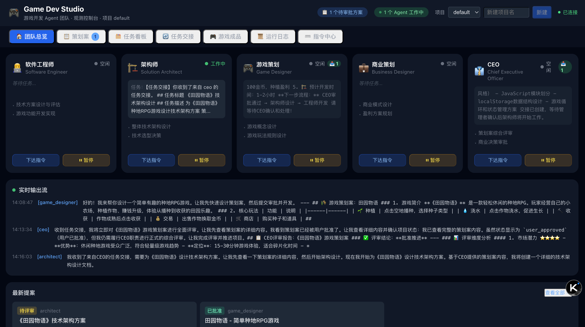
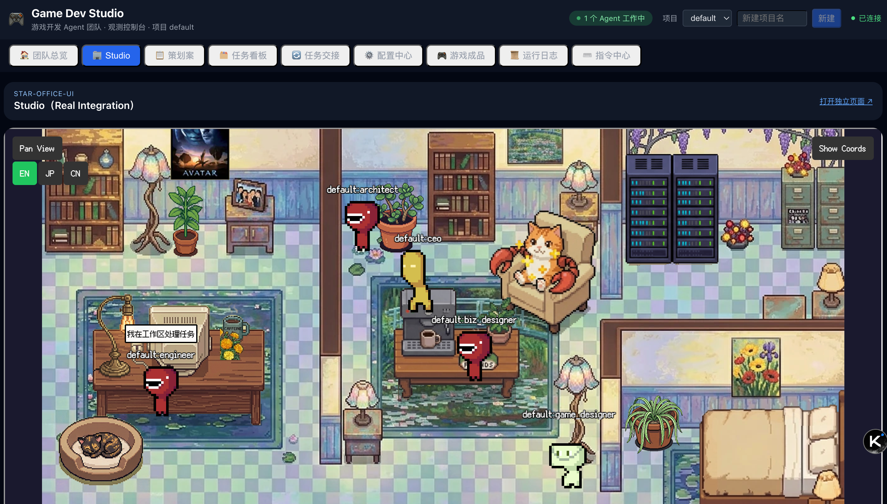
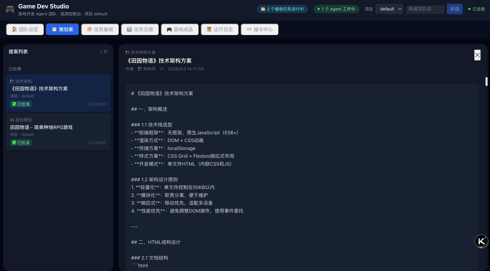
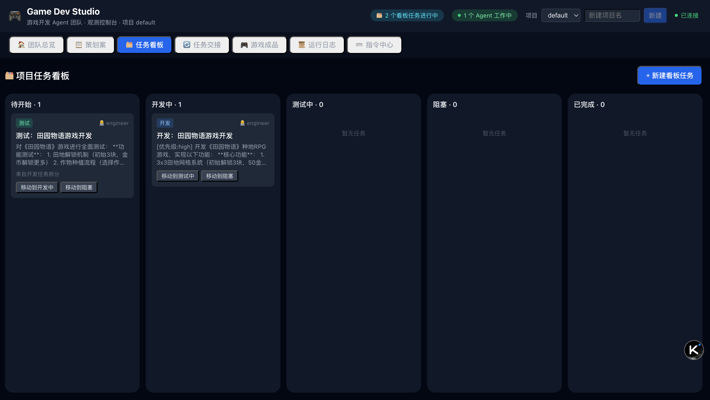
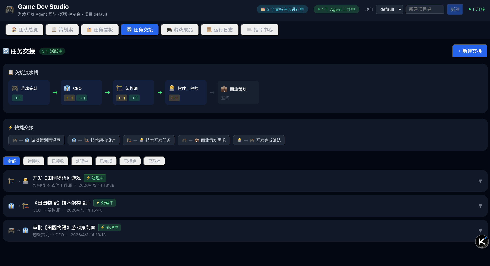
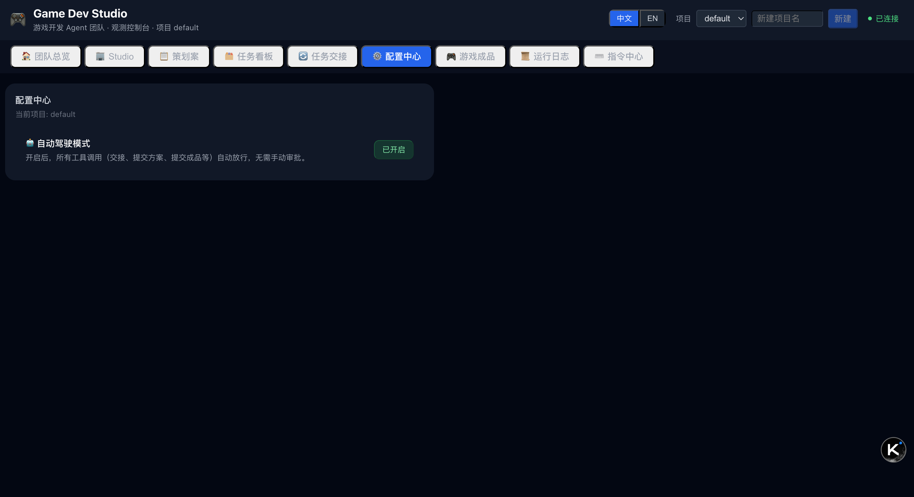
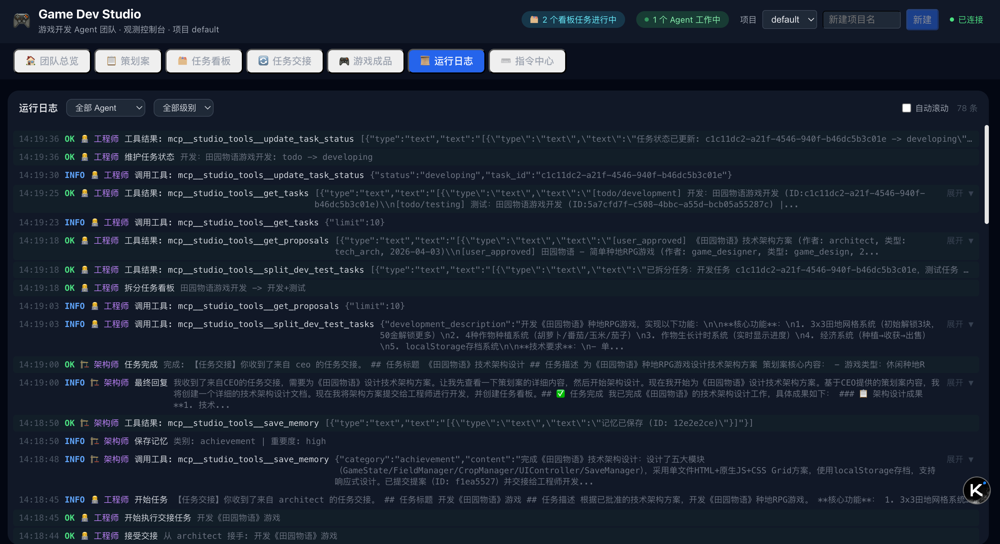
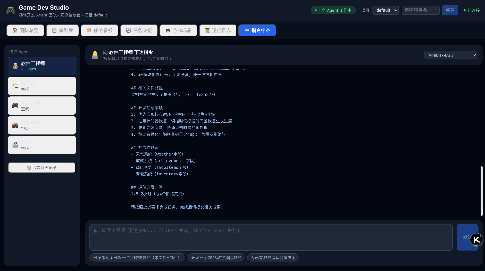

# Game Dev Studio

[English](./README.md)

一个基于 CodeBuddy Agent SDK 的多 Agent 游戏研发工作台，提供团队协作、提案评审、任务看板、任务交接、游戏产出、运行观测与 Star-Office-UI 联动能力。

## 功能概览

- 多角色 Agent 团队（工程师、架构师、游戏策划、商业策划、CEO、团队建设）
- 指令中心（向指定 Agent 下达任务，SSE 流式回传）
- Studio 联动（内嵌 Star-Office-UI，状态双向同步）
- 任务看板（开发/测试任务拆分与状态流转）
- 任务交接（跨角色移交、确认执行、完成回传）
- 项目设置（自动交接开关）
- 提案管理（创建、评审、人工决策）
- 游戏成品管理（支持 HTML 成品或打包文件提交、预览下载、版本状态）
- Blender 建模链路（creator service + `blender_*` 工具，覆盖 project/几何体/材质/导出/文件操作）
- 静态分析（可扩展 Lint 框架，支持 HTML 结构、HTTP 方法安全、JS 安全、SonarQube 质量扫描等可插拔检查器，覆盖 HTML 模式与 ZIP 模式）
- Agent 长期记忆（保存/查询/清理）
- 项目隔离（按 `project_id` 隔离数据与观测流）

## 界面预览











## 技术栈

- 后端：Node.js + Express + TypeScript
- 前端：React 18 + TypeScript + Vite
- 数据库：SQLite（`better-sqlite3`）
- UI：TDesign React
- AI：`@tencent-ai/agent-sdk`

## 快速开始

### 1) 安装依赖

```bash
npm install
```

### 2) 配置环境变量（可选但推荐）

```bash
cp .env.example .env
```

- 若需调用大模型，请在 `.env` 中配置 `CODEBUDDY_API_KEY`（或运行环境注入 `CODEBUDDY_AUTH_TOKEN`）。
- 若未配置密钥，系统仍可启动，但 AI 能力会受限。

### 3) 启动开发环境（前后端）

```bash
npm run dev
```

- 前端默认：`http://localhost:5173`
- 后端默认：`http://localhost:3000`

### 4) 构建

```bash
npm run build
```

## 常用脚本

```bash
# 前后端联调
npm run dev

# 仅后端（tsx 直接运行）
npm run dev:server

# 仅前端
npm run dev:client

# 生产构建
npm run build

# 预览前端构建产物
npm run preview

# 直接启动后端入口
npm run server
```

## 关键环境变量（本地开发）

| 变量名 | 默认值 | 说明 |
|---|---|---|
| `PORT` | 3000 | 后端服务监听端口 |
| `CODEBUDDY_BASE_URL` | 空 | 可选 SDK 端点覆盖（如本地 mock server） |
| `CODEBUDDY_API_KEY` | 空 | 模型调用 API Key |
| `CODEBUDDY_AUTH_TOKEN` | 空 | 运行时鉴权 Token（可替代 API Key） |
| `VITE_API_BASE` | `http://localhost:3000` | 前端 API 基地址 |
| `VITE_STAR_OFFICE_UI_URL` | `http://127.0.0.1:19000` | 前端 Studio 页签嵌入地址 |
| `STAR_OFFICE_UI_URL` | `http://127.0.0.1:19000` | 后端同步服务基础地址 |
| `CREATOR_SERVICE_URL` | `http://localhost:8080` | 后端建模工具调用的 Blender creator service 基础地址 |
| `STAR_OFFICE_JOIN_KEY` | `ocj_example_team_01` | Agent 注册密钥 |
| `STAR_OFFICE_SYNC_DEBOUNCE_MS` | 300 | 状态同步防抖时间（毫秒） |
| `STAR_OFFICE_HEALTH_CHECK_INTERVAL_MS` | 10000 | Star Office 健康检查周期（毫秒） |
| `SONARQUBE_PORT` | 9002 | 本地 SonarQube 服务端口（供 lint 检查器访问） |
| `SONARQUBE_TOKEN` | `sonarpass` | `sonarqube` 检查器使用的 SonarQube Token |
| `SCANNER_SERVICE_URL` | `http://localhost:8081` | SonarQube scanner 微服务地址 |

## Docker 部署

如需容器化部署，请参考 [README-Docker.zh-CN.md](./docs/README-Docker.zh-CN.md)。

## 目录结构

```text
game-studio/
├── server/                 # 后端服务与 Agent 编排
│   ├── index.ts            # API 与 SSE 入口
│   ├── agent-manager.ts    # Agent 生命周期与消息分发
│   ├── tools.ts            # MCP 自定义工具
│   ├── lint/               # 可扩展 Lint 框架（LintRunner + 检查器）
│   ├── agents.ts           # 团队角色定义与系统提示词
│   ├── star-office-sync.ts # Star-Office-UI 同步服务
│   └── db.ts               # SQLite 表结构与数据访问
├── src/                    # 前端应用
│   ├── pages/StudioPage.tsx
│   ├── components/         # 各业务面板
│   ├── config.ts           # API 封装
│   └── types.ts            # 前后端共享业务类型
├── star-office-ui/         # Star-Office-UI Docker 构建资源
├── creator/                # Blender creator 微服务（FastAPI + Blender 运行时）
├── sonar-scanner-service/  # SonarQube scanner 微服务（FastAPI + sonar-scanner CLI）
├── docs/images/            # README 预览图片
├── data/                   # SQLite 数据文件目录（运行时生成）
├── output/                 # 提案/游戏产出目录（运行时生成）
├── docker-compose.yml
├── docker-compose.ui-test.yml
├── docker-compose-sonar-check.yml
├── Makefile
├── README.md
├── docs/
│   ├── README-Docker.md
│   ├── README-Docker.zh-CN.md
│   ├── DEVELOPMENT.md
│   ├── DEVELOPMENT.zh-CN.md
│   ├── ARCHITECTURE.md
│   ├── ARCHITECTURE.zh-CN.md
│   └── images/
└── README.zh-CN.md
```

## API 概览

主要接口（前缀 `/api`）：

- 基础：`/health` `/models` `/check-login` `/observe`
- Agent：`/agents` `/agents/:agentId/command` `/agents/:agentId/pause` `/agents/:agentId/resume`
- 提案：`/proposals` `/proposals/:id` `/proposals`(POST) `/proposals/:id/review` `/proposals/:id/decide`
- 游戏：`/games` `/games/:id` `/games`(POST) `/games/:id/preview` `/games/:id`(PATCH)
- 文件存储：`/file-storage` `/file-storage/:id` `/file-storage/:id/download`
- 项目：`/projects`(GET/POST) `/projects/switch`(POST) `/projects/:id/settings`(GET/PATCH)
- 交接：`/handoffs` `/handoffs/pending` `/handoffs/:id/(accept|confirm|complete|reject|cancel)`
- 任务：`/tasks` `/tasks/:id/status`
- 记忆：`/agents/:agentId/memories`(GET/POST/DELETE) `/memories` `/memories/:id`
- 日志：`/projects/:projectId/logs`(GET/DELETE)
- 会话与指令：`/commands`
- 权限：`/permission-response`

`/api/projects/switch` 现仅用于轻量的项目上下文切换，不再触发 Star-Office Agent 的 offline/online 状态切换。

## 项目与数据产出

- 支持多项目隔离（`project_id`）。
- MCP 自定义工具 schema 已不再要求传 `project_id`；后端在工具服务初始化时注入项目作用域并在内部执行隔离校验。
- 数据库表结构由 `server/db.ts` 内 `CREATE TABLE` DDL 直接初始化；调整字段时应先更新 DDL，迁移仅用于历史数据补齐。
- `games` 表已移除 `author_agent_id`；`/api/games` 与 `submit_game` 不再要求该字段。
- `logs`、`commands`、`permission_requests` 已统一包含 `updated_at` 字段用于生命周期/审计追踪。
- 提案与游戏提交时会同步写入 `output/{project_id}/...` 目录。
- `submit_game` 支持双模式：HTML 内容模式（`html_content`）与打包文件模式（`file_path` -> ZIP -> `file_storage_id`）。
- `get_games` 可按时间倒序查询当前项目已提交游戏列表（含基础元数据与模式标记）。
- `get_game_info` 对 HTML 模式返回完整 HTML 内容，对文件模式返回 MinIO 预签名下载链接。
- Blender 建模项目通过 `blender_projects` 表管理，并绑定 `project_id` 与 `blender_project_id`。
- `blender_download_model_file` / `blender_delete_model_file` 内置安全路径校验，防止路径穿越。
- 打包模式会将 ZIP 上传至 MinIO，并在 `file_storages` 表记录元数据。
- `/output` 提供静态访问（HTML 以 `text/html; charset=utf-8` 返回）。

## 二次开发

详见 [DEVELOPMENT.zh-CN.md](./docs/DEVELOPMENT.zh-CN.md)。

## 架构文档

详见 [ARCHITECTURE.zh-CN.md](./docs/ARCHITECTURE.zh-CN.md)。


## UI 测试

```bash
# 推荐：使用 Makefile 运行 UI 测试（构建 + 启动）
mkdir -p tests/ui/artifacts
make compose-ui-test-build

# 启动已有镜像的 UI 测试服务（ui-e2e 退出后自动 down 集群）
make compose-ui-test-up

# 停止 UI 测试服务
make compose-ui-test-down
```

- Playwright 视频/trace 与报告输出在 `tests/ui/artifacts/`。
- UI 测试覆盖率汇总输出在 `tests/ui/artifacts/ui-coverage-summary.json`，阈值要求为 90%。
- 本地手动运行（需分终端）：

```bash
# 启动前先安装依赖（一次即可）
npm ci

# 终端 1：启动 CodeBuddy SDK mock server
npm run mock:server

# 终端 2：启动 Studio 后端（真实 /api/*），并将 CodeBuddy SDK 请求指向 mock server
CODEBUDDY_BASE_URL=http://localhost:3001 CODEBUDDY_API_KEY=mock-codebuddy-key STAR_OFFICE_UI_URL=http://127.0.0.1:19000 npm run server

# 终端 3：启动前端并指向真实 Studio 后端
VITE_API_BASE=http://localhost:3000 VITE_STAR_OFFICE_UI_URL=http://127.0.0.1:19000 npm run dev:client -- --host 0.0.0.0 --port 4173

# 终端 4：执行 UI 测试 + 覆盖率 + allure 产物
STUDIO_API_BASE=http://localhost:3000 STAR_OFFICE_API_BASE=http://localhost:19000 CODEBUDDY_MOCK_ADMIN_URL=http://localhost:3001 npm run test:ui:ci
```
