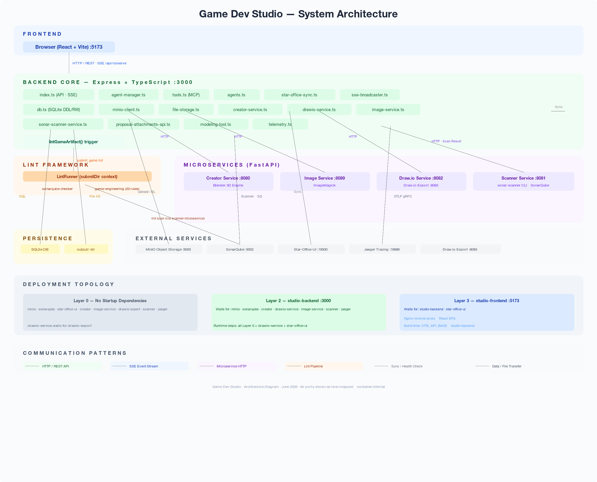
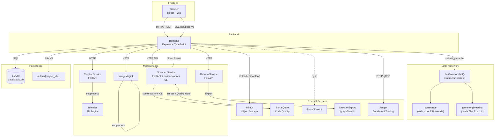

# Game Dev Studio Architecture

[中文文档 (Chinese)](./ARCHITECTURE.zh-CN.md)

This document describes the current architecture of Game Dev Studio from system boundaries to module responsibilities and key runtime flows.

## 1. System Scope

Game Dev Studio is a multi-agent game development workspace:

- Frontend web app for collaboration and observability
- Backend API/SSE service for orchestration and persistence
- Agent runtime integration based on `@tencent-ai/agent-sdk`
- Optional Star-Office-UI bidirectional state synchronization

## 2. High-Level Architecture

### 2.1 Diagram (PNG)



### 2.2 Mermaid Source (Text)

<details>
<summary>Click to expand Mermaid diagram</summary>



</details>

## 3. Runtime Components

### 3.1 Frontend (`src/`)

- Main shell: `src/pages/StudioPage.tsx`
- Functional panels in `src/components/*`
- API wrapper layer in `src/config.ts`
- Shared business/event types in `src/types.ts`
- Consumes SSE events to keep UI state synchronized with backend runtime
- `QuestionnaireForm` component provides structured game design questionnaire form with multi-step input (core fields + extended fields), fetches `game_types` dynamically via `GET /api/game-types`

### 3.2 Backend (`server/`)

- `index.ts`: API entry, SSE endpoint, route wiring, static output serving
- `agent-manager.ts`: agent lifecycle, command dispatch, stream events
- `tools.ts`: MCP custom tool definitions and role constraints
- `file-storage.ts`: shared file storage APIs/internal upload helpers
- `minio-client.ts`: MinIO object operations and presigned URL helpers
- `creator-service.ts`: creator HTTP client, Blender project lifecycle/model file operations, and safe-path validation
- `drawio-service.ts`: draw.io HTTP client, diagram CRUD/export, safe-path validation
- `lint/`: extensible lint framework (LintRunner, pluggable checkers: SonarQube + GameEngineeringChecker)
- `lint/checkers/game-engineering/`: game engineering specification checker with 20 rules (8 common + 6 H5-specific + 6 phaser-mobile-specific), reads `submitDir/dist/*` files directly for validation
- `agents.ts`: role declarations, prompts, and handoff constraints
- `db.ts`: SQLite schema (DDL-first initialization) and read/write operations
- `sse-broadcaster.ts`: SSE client management and event broadcast
- `telemetry.ts`: OpenTelemetry SDK initialization (auto-instrumentation + manual spans)
- `star-office-sync.ts`: Star-Office registration/state sync/health checks
- `proposal-attachments-api.ts`: proposal attachment CRUD and file-storage binding
- `utils/questionnaire-renderer.ts`: questionnaire field-to-Markdown renderer for structured proposal submission
- `/creator/app/safe_path.py` & `/drawio-service/app/safe_path.py`: path traversal protection utility (resolves user-supplied paths within trusted base directory)

## 4. Core Business Domains

- **Projects**: project lifecycle, project switching context, settings
- **Agents**: role-based collaboration and command execution
- **Proposals**: creation, review workflow, decision states; questionnaire-based submission for structured game design input (`source='questionnaire'`, renders to Markdown via `questionnaire-renderer.ts`)
- **Tasks**: development/testing decomposition and status transitions
- **Handoffs**: cross-role ownership transfer and confirmation flow
- **Games**: directory-based artifact submission (using `games/latest/dist/` structure with `index.html` + `metadata.json` + `assets/manifest.json`), auto-generated `version_number` for unique identification, listing, file download via MinIO, and **Sonar report download**
- **Game Engineering Framework**: game type registration via `game_engineering_specs` DB table, 3 MCP query tools (`get_game_types`, `get_game_framework_spec`, `get_common_spec`), GameEngineeringChecker with 14 static analysis rules validating HTML structure, metadata schema, and H5 lifecycle contracts
- **Modeling**: Blender project management, mesh/material/export, model file pullback, **and scene object listing**
- **Diagrams/Attachments**: draw.io diagrams, exports, proposal attachment lifecycle, **and diagram element listing**
- **Lint/Quality**: extensible static analysis framework with pluggable checkers (sonarqube via scanner microservice + game-engineering checker with 20 rules), Sonar report stored as game attachment via `games.sonar_storage_id`, GameEngineeringChecker uses `submitDir` context for directory-mode file validation
- **Memories**: long-term memory records scoped by role/project
- **Logs/Observability**: runtime logs, stream events, and distributed tracing (OpenTelemetry + Jaeger, SPEC-020)
- **Permissions**: tool execution approval lifecycle and response callbacks
- **Settings**: project-level settings including autopilot toggle and **team builder model selection**

## 5. Data and Storage

- Primary persistence: SQLite (`data/studio.db`)
- Main tables include:
  - `projects`
  - `project_settings`
  - `agent_sessions`
  - `proposals`
  - `task_board_tasks`
  - `handoffs`
- `games`
- `blender_projects`
- `drawio_projects`
- `file_storages`
  - `proposal_attachments`
  - `agent_memories`
  - `logs`
  - `commands`
  - `commands`
  - `permission_requests`
  - `game_engineering_specs`
- `proposals` table includes `source` column (`manual` | `questionnaire`) to distinguish between free-text and questionnaire-based proposals; questionnaire proposals render structured input to Markdown before storage
- Game artifacts are written to `output/{project_id}/games/latest/dist/` by the engineer calling `write_game_file` tool, then packaged as ZIP by `submit_game`, uploaded to MinIO, and linked through `games.file_storage_id`
- Game submission triggers dual lint: both checkers receive `submitDir` via LintContext — SonarQube checker self-packs ZIP from the directory for external scan, GameEngineeringChecker reads `submitDir/dist/*` directly for engineering spec validation
- Sonar quality reports are stored in MinIO and linked through `games.sonar_storage_id` (downloadable from the game detail page)
- `project_settings` stores `autopilot_enabled` and `team_builder_model` (project-scoped)
- Data and outputs are isolated by `project_id`
- `games` no longer stores `author_agent_id`; author attribution should be tracked from workflow context if needed.
- `logs`, `commands`, and `permission_requests` include `updated_at` for state transition tracking.

## 6. Communication Model

### 6.1 Request/Response

- Frontend invokes backend APIs under `/api/*`
- Backend validates, updates state, persists records, and returns normalized payloads

### 6.2 Event Streaming

- Frontend subscribes to `/api/observe` (SSE)
- Backend pushes domain events such as:
  - agent status/log/stream events
  - proposal/task/handoff/game lifecycle updates

## 7. Integration Architecture (Star-Office-UI)

- Frontend embeds Star-Office-UI in an isolated panel
- Backend performs server-side sync with Star-Office endpoints
- Supports debounced sync, health monitoring, and all-project synchronization
- Endpoints are derived from `STAR_OFFICE_UI_URL` (`/set_state`, `/agent-push`, `/join-agent`, `/agents`, `/health`)
- `/api/projects/switch` no longer drives Star-Office agent sync transitions; agent sync is maintained continuously across projects

## 8. Security and Isolation Considerations

- Project-level isolation via `project_id` in data and event paths
- Tool schemas do not require `project_id`; runtime scope is injected by backend and enforced internally
- SSE broadcaster skips emission when `projectId` is missing to avoid cross-project event leakage
- Model file download/delete enforces safe-path constraints inside `output/{project_id}/models`
- Creator and draw.io services resolve project paths with `safe_path.resolve_safe_path()` utility to prevent traversal
- Controlled route namespaces under `/api/*`
- Output files are constrained to managed output directories
- Tool usage is constrained by role and workflow rules

## 9. Deployment Topology

- Local development: single-node backend + frontend dev server
- Docker deployment: frontend/backend + creator service + draw.io service + draw.io export + SonarQube + scanner microservice + Jaeger (OpenTelemetry tracing) containerized (see `README-Docker.md`)

### 9.1 Service Dependency Graph

Services start in layers. Each service waits for all services in lower layers to be healthy before starting.

```
Layer 0 (no startup dependencies):
  minio  sonarqube  star-office-ui  creator  image-service  drawio-export  scanner

Layer 1:
  drawio-service ── waits for ──> drawio-export

Layer 2:
  studio-backend ── waits for ──> minio  sonarqube  creator  drawio-service
                                   image-service  scanner  [jaeger]

Layer 3:
  studio-frontend ── waits for ──> studio-backend  star-office-ui
```

| Service | Startup Dependencies (depends_on) | Runtime Dependencies (URL-based) |
|---------|-----------------------------------|---------------------------------|
| `minio` | none | — |
| `sonarqube` | none | — |
| `star-office-ui` | none | — |
| `creator` | none | `studio-backend` → `http://creator:8080` |
| `image-service` | none | `studio-backend` → `http://image-service:8089` |
| `drawio-export` | none | `drawio-service` → `http://drawio-export:8080/export` |
| `scanner` | sonarqube | `studio-backend` → `http://scanner:8081` |
| | | `sonarqube` → (SONAR_HOST_URL) |
| `jaeger` | none | `studio-backend` → `http://jaeger:4317` (OTLP gRPC) |
| | | Python microservices → `http://jaeger:4317` |
| `drawio-service` | `drawio-export` | — |
| `studio-backend` | minio, sonarqube, creator, drawio-service, image-service, scanner | star-office-ui, minio, creator, drawio-service, image-service, scanner, sonarqube, jaeger |
| `studio-frontend` | studio-backend, star-office-ui | `studio-backend` (build-time via `VITE_API_BASE`) |
- Runtime directories:
  - `data/` for SQLite DB
  - `output/` for generated artifacts

## 10. Extension Principles

- Keep API, data model, and SSE events aligned when adding features
- Preserve project isolation semantics for any new domain object
- Update role prompts/tool constraints when changing agent workflows
- Maintain backward compatibility for persisted data and output paths
